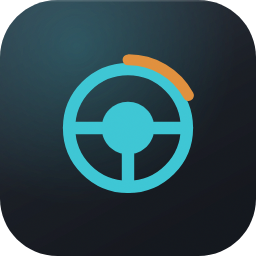

<p align="center">
  
</p>

<p align="center">
  <a href="https://github.com/renaudallard/crossover-wheel/releases/latest">
    
  </a>
  <a href="https://github.com/renaudallard/crossover-wheel/releases">
    
  </a>
  <a href="https://github.com/renaudallard/crossover-wheel/actions/workflows/build.yml">
    
  </a>
  <a href="https://github.com/renaudallard/crossover-wheel/releases/latest">
    
  </a>
  <a href="https://www.codeweavers.com/crossover">
    
  </a>
  <a href="./LICENSE">
    
  </a>
  <a href="https://www.paypal.me/RenaudAllard">
    
  </a>
</p>

<p align="center">
  <b>Force feedback for the Thrustmaster T150 in games running under CrossOver
  on macOS.</b><br/>
  No kext, no DriverKit system extension, no SIP change, no AMFI change, no
  system extension approval, and no password.
</p>

---

## Status

**It works, in a game, on real hardware.** Assetto Corsa drives a T150 through
this, with force feedback the tester describes as *"similar to the normal T150
in Assetto Corsa on Windows with the official drivers"* — the vendor's own
setup as the benchmark.

|  |  |
| --- | --- |
| Force feedback in a game | **works** |
| Unplug and replug mid race | **works** |
| Restarting the daemon under a running game | the proxy reconnects and says the effects again, never felt on hardware |
| Pedals, steering range, boot mode, sleep and wake | **works** |
| A small knock when the wheel is left standing at four positions | the wheel's own damper loop, [A46](docs/RESEARCH.md) |
| The application, when you click it | **no automated test can, and its faults come from use** |

That last line is meant literally. Nothing on a build machine can press a menu
bar item, so no test here exercises the application the way a person does, and
that is where its faults have come from instead: it has been changed thirty
five times, and the two most recent are somebody reporting that Stop followed
by Start would not start.

What it does rather than what it shows is checked. Everything it does to a
bottle happens through `install.sh`, and the self updater through
`dist/update.sh`, and both are driven against synthetic trees on every build.
`make check-mac` compiles the application's own source against stub frameworks,
so at least it cannot reach a release with a warning in it.

**Picking this up?** [`docs/RESEARCH.md`](docs/RESEARCH.md) is the evidence
behind every claim here, including the routes that were investigated and are
dead, and the several times this project's own conclusions turned out to rest
on a measurement that did not support them.

## Install



**Needs macOS 26 or newer, on Apple Silicon.** That is the only release any of
this has been measured on, and the measurements are the design. B6 in
`docs/RESEARCH.md` is why it is not a formality: the `fClientSeized` check
that decides whether a non-seizing write reaches the wheel at all arrived in
26, and B6 says outright that older IOKit sources read the other way.

**One download.** Get `crossover-wheel-<version>.dmg` from the
[releases page](https://github.com/renaudallard/crossover-wheel/releases),
open it, and **drag the app onto the Applications shortcut** next to it.

Then launch it from Applications. **The first launch needs a right-click:**
choose Open rather than double-clicking, and confirm. macOS marks everything a
browser downloads and asks about anything not signed by a paid developer
identity. That is once, ever, and **no password is needed at any point** —
nothing is installed outside your own account.

When it opens it asks which CrossOver bottle your game is in, and puts the
proxy there, along with the registry override and the two settings without
which the wheel does not appear inside a bottle at all. That is the only
thing it installs.

**"Turn hidraw off in this bottle" is ticked, and should stay ticked.** With
hidraw on, the wheel has been measured missing from the bottle entirely
(RESEARCH.md A25), so that tick is one registry value telling CrossOver's
winebus not to use that route. It is the whole bottle rather than the wheel:
untick it if something else in that bottle needs hidraw, such as a wheelbase
with its own force feedback, which reaches it that way and no other. The
bottle picks it up the next time it starts.

Afterwards it lives in the menu bar as a small steering wheel. Start and stop
the daemon there, see whether the wheel is connected and whether a game is
pulling on it, and switch on **Start at login** to never think about it again.
That switch takes effect at once in both directions: turning it on hands the
daemon to launchd and starts it now, turning it off stops the one that is
running. Only one daemon runs at a time, so if one was started some other way
the menu says so and leaves it alone rather than starting a second beside it.

**Start at login brings this application up as well as the daemon**, and it
used to bring up only the daemon. The wheel worked and there was no menu bar
icon to see it with, no status line, no *Copy the log*, and no way to change
the rotation, which is the whole of what somebody who logs in and finds
nothing there means by "start at login does not work". They are two launchd
jobs, because they run two different programs: the daemon's carries
`KeepAlive` so a death is repaired, and this application's carries none,
because an application you quit has to stay quit. The daemon starts the
moment you tick the row; the menu bar item is already running, so it starts
itself from the next login rather than opening a second copy beside this one.

**Tick it from a copy in Applications**, not from the disk image. The item
records where this bundle is, and macOS runs an app that is still in the
folder it was downloaded to from a temporary place of its own that is gone
before the next login. Ticking the row from either now says so and does
nothing, rather than writing an item that can never start anything and a tick
that looks exactly like one that works. If launchd refuses the item for any
other reason the row goes back off and says so, and any daemon that was
running is left running.

**A daemon that dies rather than being stopped leaves the wheel holding its
last force**, because putting the wheel back into a safe state is something it
does on its way out and a death is exactly the exit that does not. The menu
starts another one and says so in the log, since taking the wheel scrubs every
effect slot and that is the whole recovery. Once only: if the second one dies
too it says that and leaves it stopped, because a daemon that cannot stay up
is a fault to read rather than a loop to run.

| icon | meaning |
| --- | --- |
| thin hub | the daemon is stopped, or the wheel is not one it can drive yet: unplugged, still starting up, or in the PS4 position |
| filled hub | the daemon holds the wheel |
| full hub | a game is streaming force feedback |

**Wait for "wheel connected" before launching a game.** A wheel that has just
been plugged in, or that has just come back from sleep, is at the generic boot
identity every T-series wheel shares rather than at its own, and a game that
enumerates it there sees a different device: the buttons you mapped are mapped
against something it can no longer find. The menu says *wheel starting up, not
ready for a game* until the switch has happened, which takes a few seconds and
which the app and the daemon both do by themselves.

**Your button mapping now survives a replug.** It did not, and the way it
failed was hard to read: the wheel came back under its own name, the game
found it, and every button had to be mapped again. DirectInput builds a
joystick's instance GUID, which is what a game stores to find its device
again, out of the order that device arrived in the bottle, so the same wheel
gets a different one every time it leaves and returns, and this wheel returns
whenever it is replugged, wakes up, or makes its own switch out of boot mode
while the bottle is already running. The proxy hands games one GUID for the
wheel and translates it back on the way in, so the wheel is the same device
every launch. RESEARCH.md B14.

That costs you one last remap, on the first launch after this version,
because what the game has saved is the old kind. And it is only the mapping:
a game that was already running when the wheel left the bus still has to be
restarted, because it is bound to a device that has gone.

**The menu names the PS4 position too**, as *wheel in the PS4 position: set its
switch to PS3 and replug*. That state is a wheel plugged in, findable at
`044f:b66d` and rigid, at an identity nothing here drives, and the only fix is
the selector on the base of the wheel. It used to read *no wheel found*, which
was honest about the two ids the app asked after and wrong about the wheel in
front of you, and it sent one person hunting for a fault in the software instead
of looking at the switch.

**Copy the log** puts what the daemon has printed on the clipboard, whether or
not a window is open to show it. A long tail of it rather than the whole
history, which is what the session you are describing needs. That log is how
nearly every fault in this project was found, so if something looks wrong it
is the thing worth sending. It works in either mode: a daemon the app started
is read from its pipe, and one started at login is read from
`~/Library/Logs/t150d.log`, which
is where the login item sends it. Both of the daemon's output streams go
there, so that file opens with the port it is listening on and the backend it
got, which are the two lines that say it started at all; with only one stream
captured, a login daemon that came up perfectly and one that was never spawned
left the same empty file. Nothing else would ever shorten that file,
so the application empties it once it passes a few megabytes: what a log is
for here is the session you are about to describe.

**Updates install themselves.** The application looks for a new release every
time it starts, and says nothing unless there is one; *Check for updates* in
the menu asks on demand and does answer when there is nothing new. Installing
one downloads the disk image, checks it against the checksum published beside
it and refuses to go on without one, verifies its signature and that it
identifies itself as this application,
then replaces itself and starts again. Nothing it downloads carries
the quarantine flag a browser sets, so an update needs none of the right-click
Open and dragging the first install did. The old copy is moved aside and only
removed once the new one is in place, so a failure leaves the version you had
rather than nothing at all.

**An update replaces the application and not the bottle.** The proxy lives
inside CrossOver and only the install puts it there, so the menu checks: when a
bottle holds a proxy that is not the one in the application, it offers *Update
the proxy in* those bottles, by name. That is the install you already know, in
a window that says it is an update and names them rather than asking which
bottle the game is in, and one press does every one of them, one after
another. It stops at the first that fails and says which were not tried.

**The row only appears when the proxy really changed.** It used to appear
after every application update, because the proxy carries a build string and
that string was the release: 0.3.0 and 0.3.1 have not one commit between them
under `src/dll`, and the menu still offered to replace the one in the bottle,
the install still replaced it, and nothing about the game changed. The string
now names the last commit that touched what the proxy is built from, so two
releases that leave the proxy alone build the same bytes and the row stays
away. When it does appear, the update is one.

**Two settings the wheel keeps for itself** are in that menu too, because no
game can ask for either as you want it. DirectInput has no property for a
wheel's rotation at all, and its centring spring property is only on or off,
with no strength. On Windows both live in the vendor's control panel.

- **Rotation** sets lock to lock: 270, 360, 540, 720, 900 or 1080 degrees. Set
  it to whatever your game's own steering setting says. **1080 is the wheel's
  own**, which is where it powers up (A49), so that row is how you get back to
  standard travel. Every row sends its number, because a wheel keeps a range
  until it is unplugged and there is no packet meaning "forget what I told
  you"; whatever is chosen is reapplied after a replug.
- **Centring spring** is for games that send **no** force feedback at all,
  where the wheel would otherwise stay limp. Off by default, because a game
  that does send forces has the spring fighting them. A game that turns the
  spring off holds it off for as long as it is connected, since that much
  DirectInput does have; the setting here is what the wheel returns to once
  the game lets go.

Both are written straight to the wheel and remembered, because the wheel
forgets them when it is unplugged and the daemon is the only thing that
notices a replug. Remembering means restarting the daemon with the new value,
so while a game is connected the menu deliberately does not: the wheel has the
setting at once, and says so, but the daemon restates the old one after a
replug until it is restarted. The spring is also what the wheel returns to
whenever a game lets go, rather than being released outright: that used to
undo the setting on the first game that exited, so it survived one game at
most.

**Made a new bottle since?** *Install into a bottle…* in that menu puts the
proxy into it, and that is the only thing the application ever installs. The
list is re-read every time it opens, so a bottle made five minutes ago is in
it, and a second bottle costs one dialog.

**The application needs nothing on your PATH.** It carries the daemon it was
built against and runs that one, so the two always match. `t150ctl`,
`t150boot` and the probes are for people who want them: `./install.sh` from a
source tree puts them in `~/.local/bin`, and nothing in the menu bar route
depends on that having happened.

**If it says it was "prevented from modifying apps on your Mac"**, turn on
crossover-wheel under System Settings, Privacy and Security, **App
Management**, and press Install again. Nothing here modifies an application:
what it needs is to *read* CrossOver's own `dinput8.dll`, which lives inside
`CrossOver.app`, and macOS gates reaching into another app's bundle behind
that same switch. Running `install.sh` from a terminal is the other way round
it, because a terminal already holds that permission.

**If macOS says the app is damaged**, the copy you have is older than 0.1.34.
That message means the bundle carried no signature at all, and it is a dead
end: no button, and right-click Open does nothing for it. The bundle is
ad-hoc signed now, which turns it into the ordinary unverified-developer
dialog that right-click Open does answer. Ad-hoc is not a paid identity and
never clears Gatekeeper by itself; that is the one thing missing, and it costs
$99 a year.

### From a source tree, or without the installer

```sh
make            # build and test
make install    # the same work, from a terminal
make app        # just the application
make dmg        # the disk image
```

`install.sh` is the script the application runs from inside its own bundle, so
both routes do exactly the same thing to your bottle. `./install.sh -n` shows
what it would do and changes nothing; `-b` names the bottle so it asks
nothing; `--no-bottle`, `--no-binaries` and `--no-app` each do less;
`--keep-hidraw` is the checkbox above, unticked.

### Once it is installed

```sh
t150boot          # only before the daemon runs: it does this itself afterwards
t150d -v -w       # start before the game, leave it running
```

None of that is needed if you use the menu bar item.

**Set the game's own steering rotation to 1080 degrees**, which is what this
wheel is, or set the wheel to whatever the game is at with **Rotation** in the
menu. No game can tell a wheel what range to be at, so the two have to be made
to agree by hand, and a game left at its default of 900 against a wheel at
1080 steers by 900/1080 of what it means to.

If the game calibrates and reports about 1030 rather than 1080, that is
expected and needs no correcting. The wheel's limit is a force rather than a
stop, so a calibration always ends a little short of the nominal figure, and a
game that measured 1030 scales itself to 1030 and is right. A49.

**Sit at the machine.** Writing to the wheel is gated on being the console
user, so this fails over SSH and from a fast-user-switched session. On an
Apple Silicon laptop, approve the wheel in System Settings, Privacy and
Security, Accessories.

## Why this exists

A T150 on a Mac is already half working, and it is worth being precise about
which half.

**Already works, with nothing installed.** macOS enumerates the wheel as an
ordinary joystick once it is in firmware mode, and early sessions had
CrossOver passing it into the bottle, steering and pedals working in games.

**Broke, was diagnosed, and works again: the wheel in the bottle.** Tests
13 and 15 measured the wheel absent from the bottle entirely, axes
included. The cause was read out of the shipped software: the SDL that
CrossOver 26 bundles, 2.30.12, is the last release whose HIDAPI layer
still claims every Thrustmaster device as a possible PlayStation pad and
drops it. `SDL_JOYSTICK_HIDAPI=0` in the bottle's environment fixes it,
confirmed on hardware in test 16, and belongs in `cxbottle.conf` so every
launch gets it. The install also turns hidraw off in that bottle, because
with hidraw on the wheel has been measured missing from it altogether
(A25), and that pins the wheel to the SDL route: the thirteen buttons
A37 named whole were named on the other route, so anyone who wants that
one back unticks the box, or passes `--keep-hidraw`. The one remaining
input fault was measured to its cause: the T150's own descriptor labels
the pedals backwards, which `T150_PEDALS` can correct for a game that
needs it. [`docs/RESEARCH.md`](docs/RESEARCH.md) B10, B11, A25, A35 and
A37.

**Does not work: force feedback, because the T150 brings no PID
descriptor.** Wine's DirectInput sets `DIDC_FORCEFEEDBACK` only from a
Physical Interface Device collection it finds in a descriptor, and the
T150's declares none. This is precise, not general: a wheelbase that does
carry a PID collection, a Simucube, gets native untranslated force feedback
in CrossOver on macOS today through the hidraw path, which is why four of
them are on CodeWeavers' allowlist (RESEARCH.md B12). The Fanatec entry on
that list is a set of ClubSport pedals, which render nothing. The T150
cannot ride that path. On the SDL path it arrives without a PID collection
too: the SDL backend synthesises one only for a device SDL calls haptic,
and SDL's macOS haptic backend is `ForceFeedback.framework`, which reaches
only devices whose driver published a plug-in. No wheel vendor ships one.

**Cannot be fixed at the macOS layer.** Presenting the wheel to macOS as a
force feedback device is closed off for reasons unrelated to code signing.
`ForceFeedback.framework` only reaches devices whose driver published an
`IOCFPlugInTypes` plug-in, and `IORegistryEntry::setProperties` returns
`kIOReturnUnsupported`, so userspace cannot inject one.
`IOHIDUserDeviceCreate` needs `com.apple.developer.hid.virtual.device`, the
same restricted-entitlement wall as DriverKit.

So the force feedback device gets presented **inside the bottle** instead.

## How it works

```
game (in the bottle)
  |  DirectInput 8
  v
t150-dinput8.dll   proxy, forwards everything except force feedback
  |  normalized effects over 127.0.0.1
  v
t150d              macOS daemon, unprivileged, no entitlement
  |  IOHIDDeviceSetReport
  v
the wheel
```

The wheel still reaches the game through the normal path for input, so there
is no synthetic device, no descriptor splicing and no duplicate wheel to
hide. See [`docs/ARCHITECTURE.md`](docs/ARCHITECTURE.md), including why an
in-bottle bus driver was considered and rejected.

## What exists today

| Component | State |
| --- | --- |
| `probe_hid`, `probe_ep0` | working, macOS only |
| `probe_setreport`, the HID writer | working, macOS only, no root. **The wheel obeys it** |
| `probe_intr`, the interrupt OUT writer and pipe reader | working, macOS only, needs root. The wheel obeys it too |
| `include/t150/*.h` shared contracts | written, compiled and tested on Linux |
| `src/lib/encode.c` wire encoders | written, golden-vector tested on Linux |
| `src/lib/proto.c` DLL to daemon protocol | written, round-trip tested on Linux |
| `t150d` protocol, slots, downgrades, watchdog | written and tested on Linux |
| `src/t150d/wirequeue.c` the writer's coalescing queue | written and tested on Linux; the threading around it is macOS only |
| `t150d` macOS HID backend | working: drives a real wheel unprivileged under a running game, survives unplug and replug, and its shutdown stops a runaway effect |
| `t150-dinput8.dll` the in-bottle proxy | working: Assetto Corsa drives the wheel through it, and it reconnects by itself to a restarted daemon |
| `probe_dinput.exe` the in-bottle probe | run on hardware in test 27: it mapped the wheel, walked all twenty one controls with a person answering, and played two effects that were felt. Also runs under Wine in CI against a wheel shaped uinput device |
| build, CI, docs, man pages | working |
| `install.sh` | installs both halves, tested against a synthetic CrossOver tree; the bottle half has only been run for real by hand |
| `crossover-wheel.app` | the menu bar item and graphical installer. **Compiled by CI, and no test presses any of it**: it is a front end over `install.sh`, which is where anything that can go wrong lives |
| `t150ctl`, `t150boot` | working on hardware, including the rotation range, which visibly shortens and restores the wheel's travel |

The encoders turn a normalized effect into the wheel's packets and are the
only code that knows both DirectInput units and wheel units. They do no I/O,
so `make test` checks every byte they produce against vectors derived from
`docs/PROTOCOL.md`, on any machine.

The daemon listens, speaks the protocol, keeps the slot table, downgrades the
effects the wheel cannot render, slides ramps, and runs the watchdog. On macOS
its packets go to the wheel through `IOHIDDeviceSetReport`; `-n` swaps in the
logging backend instead, which is the only behaviour anywhere else and is what
lets the whole stack be driven from a test with no Mac and no wheel. A frame
sets what a slot should hold and a
rate-limited pass puts on the wheel whatever actually changed, so a game
re-sending an effect it has not touched costs a comparison rather than three
writes. That is enough to drive the whole stack from a test
without a Mac, which is what `socket_check` does, including holding a socket
open and going quiet to prove the wheel gets released.

The proxy is written and cross builds to an x86_64 PE with the right five
exports and no import of `dinput8` to recurse into. It has now executed on
hardware: it wrapped the wheel, claimed force feedback and carried two
effects to the daemon that were felt (A43). There is no Wine on the
development machine and no Mac here, so
the checks that exist run in CI. On Windows they unit test the DirectInput
conversion, then load the DLL with a copy of the system `dinput8` beside it
and confirm both entry points chain-load. Under Wine on Linux they go
further: the proxy is installed over a prefix's `dinput8` with the builtin
renamed beside it, exactly as a bottle has it, a daemon is started, and the
run has to show the proxy wrapping a wheel and claiming force feedback. A
scripted sequence of effects then goes through that proxy and the daemon's
packets are checked against what the sequence asked for.

A real bottle resolved it first, in test 14 (A33), and the whole path has
since run from a game on hardware.

The wheel agrees with the settings bytes and with force feedback, on both
pipes. [`docs/PROBES.md`](docs/PROBES.md) is the procedure that established
it and the thing to rerun after any change to the encoders.

## What is left

The goal is met: a game drives the wheel, and the parts that used to need a
person babysitting them, replug, daemon restarts, boot mode, do it themselves
now. What follows is what is genuinely unfinished, and it is short.

**The knock at four positions.** With a condition effect running, the wheel
gives a small knock when it is left standing at 0, 135, 270 and 405 degrees,
an eighth of its travel apart. This is the wheel and not this software:
[`docs/RESEARCH.md`](docs/RESEARCH.md) A46 reproduces it with `probe_setreport`
and one raw packet, with no game, no daemon and no proxy running. Holding the
coefficient at 80 of 100 turns a sustained buzz into that knock; going lower
buys less each step and costs real damping. What the eighth-of-a-turn spacing
actually is has never been explained, and if a cap ever turns out not to be
enough, that periodicity is the only handle anybody has.

**A range shorter than the wheel's own, under a running game.** Setting the
range to 1080 does nothing, because the wheel already powers up at its
maximum, so `-r 1080` is pointless (A49). What has never been measured is
moving the wheel to something *narrower* underneath a game, which is the only
case where `-r` has anything to do. A47.

**Nothing measures the range as 1080, and nothing will.** The limit is a force
rather than a stop: the wheel pushes back at the end of its travel and can be
pushed past it, so a game's calibration always reads short. Assetto Corsa
measures about 1030. Tell a game the number it measured rather than the number
the wheel claims, and do not add a correction to make them agree, because the
shortfall depends on how hard the wheel was pushed. A49.

**Effects nobody has felt.** A constant, a damper and two periodics have moved
a wheel. Springs, envelopes, ramps and per-effect gain are checked against
Thrustmaster's own Windows driver byte for byte (A40) and have still never
touched hardware. `probe_setreport -x` plays any of them in one line.

**Telling `0x4020` from `0x4021` back to back**, which is the last waveform
question. `0x4025` is settled: it renders nothing, because the vendor's own
effect table has no ninth entry.

**Not blocking, and not planned:** an ARM64EC build for CrossOver 27's
bottles, and an SCS telemetry plugin, which is the only route by which a
native macOS game could ever be reached.

## Using a release

Prebuilt binaries are on the
[releases page](https://github.com/renaudallard/crossover-wheel/releases),
built by CI from the tagged commit. Two archives:

| File | For |
| --- | --- |
| `crossover-wheel-<v>.dmg` | **everyone.** The application and a shortcut to Applications. The application carries the daemon, the man pages, the proxy and `install.sh` inside its own bundle |
| `crossover-wheel-<v>-bottle-probe.zip` | almost nobody: `probe_dinput.exe`, a diagnostic for when something looks wrong inside a bottle |

Both are built by rules, `make dmg` and `make probe-zip`, so that each
archive's README is the file in `dist/` rather than something assembled by
hand at release time.

**The `.dmg` is the only thing to download.** Everything is inside it,
including the proxy that goes into the bottle, because that bottle is on the
same Mac. Nothing needs to be kept afterwards, and nothing asks for a
password: the application is the only thing installed, into Applications, by
you dragging it there.

The probe is published separately because it is a measurement instrument
rather than part of the software, and because the question it used to be the
answer to now has a cheaper one: `t150d -v` prints `client connected from
port N` when a game reaches the daemon, which needs no bottle setup at all.
What the probe still does that nothing else can is show what DirectInput
itself sees: every axis and button with the offset a game reads it at, and
effects played with no game running.

Each archive carries a short README; those are `dist/README.macos` and
`dist/README.probe` in this repository, packaged verbatim at release time
so they cannot drift from what is written here.

Apple Silicon only, and there is no Intel build. Verify what you downloaded
before running it:

```sh
shasum -a 256 -c SHA256SUMS --ignore-missing
```

**Nothing here is signed by a paid developer identity or notarized.** That is
why the first launch needs right-click Open. The bundle is ad-hoc signed,
which is what makes that dialog answerable rather than the dead end macOS
shows for an unsigned one. Fetching with `curl` rather than a browser avoids
the mark being set at all.

Two more things will otherwise cost you a session, both of them macOS rather
than this project:

- **Sit at the machine.** `IOHIDDeviceSetReport` is gated on being the
  console user, so `probe_setreport` and `t150d` fail over SSH, from the
  login window, and from a fast-user-switched session.
- **Approve the wheel.** On an Apple Silicon laptop, System Settings, Privacy
  and Security, Accessories. Until you do, the wheel appears nowhere and
  `probe_hid` reports no matches.

Commands below are written as `./build/bin/...` because that is where a source
build puts them. `install.sh` puts them in `$PREFIX/bin`, which is
`~/.local/bin` unless you say otherwise, and tells you how to add that to your
PATH if it is not already there, which on macOS it is not. Once it is, `t150d`
and `t150ctl` work as written without a path at all.

## Building

On Linux, which builds and tests everything portable:

```sh
make
```

On macOS the same `make` additionally builds the four probes and the two
command line tools, because the default target names them there.

`make strict` is the same with warnings as errors, and is what CI runs. On
macOS it also builds `crossover-wheel.app`, deliberately: compiling that
Objective-C is the whole of the automated confidence in the application.
`make help` lists the targets.

`make check-mac` syntax checks every macOS only source against the fake
headers in `tests/stubs`: the application, the daemon's HID backend, the boot
switch, `t150ctl`, `t150boot` and all four probes. It needs clang, it is not
part of `all` or `strict`, and it proves only that those files parse and are
warning clean under the same flags: nothing at all about behaviour. It exists
because they were otherwise checked by being read, and reading does not find
what `-Werror` finds. A change that leaves a parameter unused is a hard
failure of the macOS job, and therefore of the release that job builds, and
one reached that job once.

The stubs declare only what those files name, and they are written from the
real headers rather than from the code. That direction matters: a stub loose
enough to accept whatever the code does turns this check into a mirror, which
is worse than having no check, because it passes. If one drifts, `check-mac`
goes quiet rather than wrong. `tests/stubs/README` says which parts are
hand-written and why the macOS job remains the authority.

Development happens on Linux; the Mac is only needed to run the probes and
the daemon. Because the probe sources cannot be compiled on Linux, CI builds
them on `macos-26` on every push and attaches them as an artifact, so a Mac
is not needed to get a binary either. That runner is named rather than
`macos-latest` because it is also the release the binaries are built for, and
CI checks that the bundle's `LSMinimumSystemVersion` and every binary's
deployment target agree with `MACOS_MIN`.

CI also runs the in-bottle probe rather than only compiling it. It runs on
`windows-latest` against a real loader, and on `ubuntu-latest` under Wine,
which is what a CrossOver bottle is. The Wine job creates a uinput device
carrying the wheel's own USB ids, `tests/fake_wheel.c`, so the probe has
something to enumerate: without one it stops at "no T150 found" and the half
of it that has actually been wrong never runs. With the device present it
enumerates every object, maps each one into the state struct and walks all
twenty one controls, and the job fails if a control does not land where the
data format puts it. That check exists because the probe first shipped
reading buttons at their enumeration offset, which is a different number and
can be negative.

The Wine job also builds and runs the daemon, so the proxy has something to
answer, and the job fails if the proxy does not wrap the wheel. Two things
follow from that. It drives a scripted sequence of real effects through the
proxy and checks the daemon's own packet log against what the sequence asked
for, which is the only place the bytes that reach a wheel are checked by
anything. And it runs the proxy once with nothing telling it where the daemon
is, so the search through `Z:\Users` that every real bottle depends on is
exercised rather than assumed: that path has failed in the field, and its
symptom is a game that runs perfectly while nobody anywhere has force
feedback.

## Setting the wheel up

**Put the wheel's switch in the PS3 position before plugging it in.** The
selector decides which device macOS sees, and it is not a preference: PS3
gives `044f:b65d`, the shared boot identity that `t150boot` takes to
`044f:b677`, which is what this project drives. PS4 gives `044f:b66d`, a
DualShock 4 shaped device running a different protocol that nothing here
applies to. A wheel in the PS4 position is not a wheel this software can drive,
but the menu does recognise it there and says so rather than reporting an empty
bus.

**Watch it calibrate.** A healthy T150 sweeps counterclockwise, then
clockwise, then back to centre as soon as it has mains power. If it does not,
Thrustmaster attributes that to power: wall outlet directly rather than a
strip, and USB into the machine rather than a hub.

Two small tools, both macOS only and neither needing root.

**A game must not see the wheel in boot mode.** DirectInput builds a device's
identity out of its vendor and product ids, so the same wheel is two different
devices to a game depending on which one it was enumerated at: `044f:b65d`
comes up as *Thrustmaster FFB Wheel*, the generic boot identity every T-series
wheel shares, and `044f:b677` as the T150. **A game started before the switch
binds to the wrong one, and every button mapped against the other is against
a device it can no longer see** — which looks like the wheel randomly needing
its whole controller configuration done again.

Nothing in the bottle can fix that afterwards: CrossOver carries in whatever
macOS enumerated. The answer is to make sure the switch has happened first.
The application does it, on its own timer and again the moment it starts, so
leaving it running in the menu bar is enough; the daemon does it too on its
own scan. From a terminal it is `t150boot`, before the game rather than after.

**`t150boot`** takes the wheel out of boot mode, which is where it starts and
where sleep, wake and every replug put it back. Nothing else works until that
switch has happened, which is not the same as needing this: the daemon sends
it on every acquire and on its own rescan, and the application on its timer
and on wake, so this is the terminal route rather than a required step:

```sh
./build/bin/t150boot
attachment 0x06, model 0x03  T150
switched, the wheel is at 0xb677
```

It exits 0 when there is nothing at the boot id too, because that is the
ordinary state once a wheel has been switched, so it is safe to run on every
plug-in from a LaunchAgent.

**`t150ctl`** sets what the wheel keeps for itself, and does not take it away
from a running game:

```sh
./build/bin/t150ctl range 270          # three quarters of a turn lock to lock
./build/bin/t150ctl autocenter 0       # let go of the wheel completely
./build/bin/t150ctl status
```

Autocenter is a progressive spring rather than a constant pull, so a low
setting stiffens the wheel without recentring it. Only `autocenter 0` releases
it; see [`t150ctl(1)`](man/t150ctl.1) for why the protocol's separate enable
flag releases nothing.

What `t150ctl` sets by hand lasts until the daemon next takes the wheel, which
scrubs it. The value that survives a game letting go and a replug is the
daemon's own: `-a` for the spring and `-r` for the range, which it restates on
every acquire, and which the menu's two rows are.

## Running the daemon

`make` builds `build/bin/t150d`. **On macOS it drives the wheel**, through
`IOHIDDeviceSetReport` with a non-seizing open, so CrossOver keeps reading it
throughout:

```sh
./build/bin/t150d -v
t150d: wheel autocentre released: sent
t150d: wheel 044f:b677 open
t150d: listening on 127.0.0.1:49713, endpoint .../t150ffb/endpoint
t150d: backend macOS HID
```

It does not need root and it does not need the wheel to be plugged in when it
starts: if the wheel is absent, or still at the boot product id, it keeps
looking and picks one up when it appears. **That includes the boot mode
switch**, which it sends itself when it finds nothing at the firmware id, so
`t150boot` is only needed before the daemon is running rather than on every
plug-in.

It does refuse to start beside another daemon already holding the same
endpoint, and refuses before it touches the wheel: taking the wheel scrubs
every effect slot, so a second daemon would do that to a running game before
discovering it was not wanted. Give each one its own `-e` to run two on
purpose.

`crossover-wheel.app` starts and stops the same daemon from the menu bar, with
`-v -w` and whatever the Rotation and Centring spring rows are set to, and
shows what it knows as an icon. The two halves of that come from different
places: whether the wheel is there it finds out itself, by the same IOKit
lookup `t150boot` uses, on its own timer; whether a game is pulling on it is
read from what the daemon prints. It runs the daemon as its own child rather
than connecting to it, because a second client can displace the first and that
would throw a game off the wheel.

`-n` drives nothing and prints every packet instead, in the same form
`probe_setreport` prints, so the two can be compared directly. That is the
only behaviour anywhere but macOS.

**A replug takes a few seconds, and most of that is the wheel.** The daemon
notices it has gone, finds it at the boot id, sends the switch and picks it up
again, each step on a half-second scan, so roughly a second and a half is
this software. The rest is the T150: a switched wheel leaves the bus,
enumerates again under its firmware id and runs its own calibration sweep
before it answers anything. Scanning faster would shave a fraction off the
smaller half and burn CPU waiting on the larger one.

**A wheel unplugged mid game comes back on its own.** It returns at the boot
product id, which is where sleep, wake and every replug leave it, so the
daemon switches it the same way `t150boot` does and picks it up on the next
scan. Nothing has to be run by hand any more, and nothing needs a password.
Any model but the T150 is refused rather than sent the T150's switch value;
use `t150boot -V` for those.

**Restarting the daemon under a running game recovers by itself.** The proxy
reconnects on its next force feedback call, at most once a second, and every
effect re-uploads and re-starts itself on the first call after that. Before
this, a restarted `t150d` cost the game its force feedback until the game was
restarted too, because nothing reachable from a device the game already holds
ever reconnected.

**And when the re-start itself is refused, the game is told.** The replay used
to throw that answer away and report success, so an effect the new daemon had
never been told to play was reported as playing and every later Download was
skipped against a slot that held nothing. A refusal now clears what the skip
compares against, and every start in the proxy goes through the one place that
knows what a refusal means.

**A start the daemon never got is sent by the next upload.** The proxy used to
drop it: `SetParameters` answered the game before it looked at `DIEP_START`, so
one refused upload cost that force for the rest of the run, and nothing
anywhere would ever say it again. It is remembered instead, and paid by the
first upload that reaches the daemon. That memory is the thing that could start
a force the player has since turned off, so it is dropped by everything that
means the game no longer wants it: a stop, an unload, a device reset, a
stop-everything and a pause.

**A client taking the wheel sets its device gain to full.** The wheel keeps a
gain of its own, nothing here ever set it, and so every force was scaled by
whatever the wheel powered up with or whatever the last process left behind.
Full means do not attenuate, which is also DirectInput's own default, so the
strength ends up where the game's settings put it. A game that wants less
says so with `DIPROP_FFGAIN`, and `t150ctl gain` still overrides it by hand.
Once a game has asked, that is the value put back whenever the wheel is
re-acquired: the proxy sends `DIPROP_FFGAIN` once and cannot send it again, so
restoring full scale after a replug used to undo the driver's chosen strength
for the rest of the session, silently.

**The rotation range is `-r`, because no game can ask for it, and the game's
setting and the wheel's own range have to be the same number.** DirectInput
has no property for wheel rotation: on Windows it is set in the vendor's
control panel and a game assumes the wheel is already there, so a game whose
settings say 900 degrees reaches nothing and scales its steering for a range
the wheel is not at. **The T150 is 1080 degrees and Assetto Corsa defaults to
900**, so out of the box they disagree, and the car responds to a given
movement of the hands by 900/1080 of what the game intends.

**Set the game to 1080.** That costs one setting and needs nothing from this
daemon. Measured: the tester did exactly that and reported "the range is
good, it's similar to the normal T150 in Assetto Corsa on windows with the
official drivers", and Assetto Corsa Competizione then detected 1080.

`-r`, and `t150ctl range`, are the other direction, for driving at a shorter
range than the wheel's own: set the game to 540 and the wheel to 540 and they
agree there too. **That direction has not been tested under a game.** The
wheel was left at its own 1080 in every session that produced the result
above.

This README said the opposite until 0.1.27, in bold: do not use `-r` with a
game. That rested on a test which set 270, 900 and 1080 under a game and felt
no difference from any of them, run before the range had ever been confirmed
to reach the wheel at all. It measured a range that was not arriving, not one
that arrives and is unwelcome.

**An upload is answered when it is accepted, not when it reaches the wheel.**
The daemon keeps what each slot should hold and writes it out from a pass
that runs at most once every 4 ms, so a game updating a force faster than
that has the superseded values dropped rather than queued, and a game
re-sending an effect it has not changed writes nothing at all.

**`-E` lets that floor be skipped while the writer's queue is empty, and it is
off.** The floor is there to keep a game's frame out of a burst of synchronous
USB transfers, and a writer thread paces itself, so against an empty queue the
floor only delays a force the wheel could have taken now. That was the default
in 0.2.2, 0.2.3 and 0.2.4 and is not now: it is the only change to how this
daemon drives the wheel in about thirty releases, and force feedback began
stopping mid session in the release that introduced it, with the wheel found
back at its boot identity, which is what a device does when it resets itself.
Nothing proves the two are connected and the measurement to settle it has not
been made. But nobody has ever felt the early pass help either, so it is not
worth carrying that suspicion by default. See
[A51](docs/RESEARCH.md).

Only effect parameters are treated this way. Starts, stops, resets, the
settings and every path that makes the wheel safe are written the moment they
arrive and are never merged, because those are things that happen rather than
values that hold. A write that fails is reported on the next upload, which is
the only frame that can carry it: an error answered to a keepalive would make
the proxy drop its connection for an error that is not one. It is also why the
proxy will not skip an upload once its last acknowledgement is `ASSUME_MS`
old: skipping delays that report and nothing else carries it. The proxy sends
no upload of its own, so the report waits on the game asking for one.

**The proxy skips an upload that would carry what the daemon already has.**
Every `Start` uploads first, so a game that starts an effect as often as it
draws a frame pays two round trips on its own thread for one of them to do
anything, and the daemon answers the first by comparing the same bytes and
sending the wheel nothing. It is bounded, and each bound is there for a
reason found the hard way: only while the connection is up and is the one the
effect was uploaded to, only if the game has not reset the device since, only
if no start or stop has been refused since, never for a ramp, and only while
the acknowledgement is younger than `ASSUME_MS`. A ramp is the interesting
one: the wheel has none, so the daemon renders it as a constant it recomputes
as the ramp slides, and for a ramp the bytes being equal does not mean the
daemon's slot is. The daemon puts the level back itself when a ramp is
started, so a skip could no longer strand one; the proxy keeps the exemption
because the two halves ship separately and this one may be talking to a daemon
that still needs it.

One consequence is visible in `-n`: a steady force prints three lines and
then nothing, where it used to print three per update.

**`-w` writes to the wheel from a thread of its own, and that is what the CPU
warning was.** Without it every packet goes out on the thread that also
answers the proxy, so while the daemon sits inside a synchronous
`IOHIDDeviceSetReport` the game is blocked waiting for a reply, on its own
main thread. The tester's overlay showed that thread swinging to 96% while
the physics thread sat flat at 20%, and with `-w` his `CPU OCCUPANCY` warning
is gone.

**The writer's queue coalesces, because the wheel is slower than the
daemon.** The emitter flushes up to four dirty slots, at worst every 4 ms and
sooner while the queue is empty, and a constant costs two packets, since
Thrustmaster's own driver pairs each update with a control, so a game holding
three effects asks for at least 1250 packets a second. The fastest that same driver ever puts two packets on the wire, in
`tmp/oldffb/directX_constforce.pcapng`, is 1.344 ms apart: about 740 a second.
A queue that merely stored the difference spent the session full and delivered
every force a fifth of a second late, which the tester felt as a wheel with no
resistance to a quick turn. So a packet still waiting when a newer one arrives
for the same parameter is replaced by it, where it stands. The wheel holds one
value per parameter and the one it never rendered could not be felt. A play and
a stop for one slot are different parameters that never merge, and only the
newest packet waiting for a given target is merged into, so a repeat cannot
overtake something queued behind it: a stop, a play and a stop for one slot
stay three packets in that order. `-v` prints the merged and refused counts on
the way out, and after coalescing a refusal means the wheel stopped taking
writes altogether. The first refusal is said when it happens too, because a log
copied off a machine that is still running never reaches the line on the way
out. A refusal is reported to the session as a failed write, so
the effect stays owed and goes again on the next pass; the queue never discards
a packet it has already accepted, because accepting one is what tells the
session it need not keep a copy.

That queue is `src/t150d/wirequeue.c`, kept apart from the macOS backend that
uses it so `tests/wirequeue_check.c` can drive every rule in it on a machine
with no wheel and no Mac.

**`-v` says what the game asks for, once a second.** Nothing in this project
recorded that for its whole life; only the bytes going out. A constant gives
its magnitude, direction and gain, and a condition gives its centre,
coefficients, saturations and deadband:

```
t150d: slot 2 constant: magnitude -8670, direction 9000, gain 10000
t150d: slot 3 damper: centre 0, coeff 9998/9998, saturation 10000/10000, deadband 0
```

A condition is named as the **spring** or **damper** it is rather than as a
condition, because the two are different forces and this line could not tell
them apart. Those are Assetto Corsa's real numbers: a damper at 9998 of
10000, which is the maximum, and the wheel is unstable there. See
[`docs/RESEARCH.md`](docs/RESEARCH.md) A46. The kind shown is what the wheel
was given, after any downgrade, which is reported on its own line. The
autocentre release is logged the same way the gain and the range are, so a
report can tell a packet that was refused from one that was never sent.

A slot that starts or stops says so too, **once per transition rather than
once per call**, because a game may start an already playing slot on every
frame and Assetto Corsa does. What that answers is whether a slot was ever
started at all: an effect uploaded and never started renders nothing, and from
the daemon's side that looks exactly like one the wheel ignores. Both lines are
said after the write and say which way it went, so neither can stand in a
report as evidence for something that never left the daemon, and every release
says which slots it took rather than only the game's own stop.

**A start the daemon turns away says so as well, and that is the half that was
missing.** One hardware report came down to a game whose constant force was
uploaded all session and never played, and the log could not say whether the
game never asked or whether it asked and was refused for a slot the daemon no
longer held. The two were byte for byte identical from here. A refusal now
names the slot and the reason, once per slot rather than once per call, so a
report of that shape answers itself. See
[`docs/RESEARCH.md`](docs/RESEARCH.md) A52. The watchdog
carries the silence it measured with it, in milliseconds, which is the only
duration anywhere in an untimestamped log: half a second is a game that
hitched over a track load and five seconds is a game or a socket that stopped.

**A condition's coefficient is held at 80% of what the wheel takes, and this
is the one place the daemon knowingly gives a game less than it asked for.**
The T150's own condition loop is unstable at the top of its range. Measured by
hand with no game, no daemon and no proxy: a damper at 100 makes the wheel buzz
where it is left standing, 99 still buzzes, 90 buzzes more slowly, 80 is
quiet. Not everywhere, and the pattern is the interesting part: it was found
at 0, 135, 270 and 405 degrees, an eighth of the wheel's nominal travel apart,
three of them unprompted and the fourth confirmed when asked (A46). An
oscillation that slows as the gain falls is the wheel fighting itself, not a
resonance.

The encoding is not what is wrong; Thrustmaster's own divisor reaches 100 for
the same request, so the wheel dislikes a value that is faithfully encoded.
What justifies overriding a game here is that nobody can work around it
themselves: Assetto Corsa asks for 9998 of 10000 and its force feedback page
has no damping control at all. The coefficient is **clamped rather than
rescaled**, so a game asking for half strength still gets half strength and
only the top of the range is flattened. The tester's verdict on the difference
at full request: *"about the same, maybe a little less hard"*. See
[`docs/RESEARCH.md`](docs/RESEARCH.md) A46.

**A client connecting opens the wheel's input; the daemon holds it open for as
long as it holds the wheel.** The firmware renders no effect while no input is
open, which is what [`docs/RESEARCH.md`](docs/RESEARCH.md) A28 established, so
the daemon sends `42 04` on hello. It sends `42 00` only on its own way out,
not when a client goes: with the input shut the firmware rests both pedals at
maximum, so closing it after every game left the next one calibrating them
fully pressed and reading every press backwards. The open also outlives the
process that sent it (A30), so the daemon stops every slot, releases the
autocenter and closes the input the moment it takes the wheel: one inherited
from a crashed daemon, or from a probe that never cleaned up, arrives still
rendering its last effect and goes quiet at startup rather than at shutdown.
The autocenter release is part of that, because closing the input re-arms the
wheel's own centring spring and would otherwise leave it stiff (A42).

See [`t150d(8)`](man/t150d.8) for the endpoint file, the watchdog and the
effect downgrades.

## Installing the proxy into a bottle

**`./install.sh` does all of this**, and the rest of this section is what it
does and why, for anyone debugging an install or doing it by hand.

`make dll` cross builds the proxy, and needs `gcc-mingw-w64-x86-64`. It has to
go in the bottle's `system32` rather than beside a game, because SDL reaches
DirectInput through `CoCreateInstance`, which the loader resolves to an
absolute `system32` path and never to a game directory.

Written against CrossOver 26.3.0, which is Wine 11. The paths and the loader
behaviour below were read out of that release rather than remembered.

**It serves 64-bit games only.** The proxy is an x86_64 PE, and a 32-bit
process has its `system32` redirected to `syswow64`, where this is not, and
Wine skips a file whose machine does not match in any case. `file "<game>.exe"`
says which one you have. There is no i386 build.

Two files, two registry values and one line in the bottle's own configuration:

```sh
CX_ROOT="/Applications/CrossOver.app/Contents/SharedSupport/CrossOver"
SYS32="$HOME/Library/Application Support/CrossOver/Bottles/<name>/drive_c/windows/system32"

# the real implementation, under the name the proxy chain-loads
cp "$CX_ROOT/lib/wine/x86_64-windows/dinput8.dll" "$SYS32/dinput8_orig.dll"

# the proxy, under the name the game and SDL ask for
cp build/bin/t150-dinput8.dll "$SYS32/dinput8.dll"

# the override, once, in the bottle's registry
"$CX_ROOT/bin/wine" --bottle "<name>" --cx-app reg.exe add \
    'HKCU\Software\Wine\DllOverrides' /v dinput8 /t REG_SZ /d native,builtin /f

# and hidraw off for that bottle, read by winebus when the bottle next starts
"$CX_ROOT/bin/wine" --bottle "<name>" --cx-app reg.exe add \
    'HKLM\System\CurrentControlSet\Services\WineBus' \
    /v DisableHidraw /t REG_DWORD /d 1 /f
```

From a release archive, use `t150-dinput8.dll` from the extracted directory
in place of `build/bin/t150-dinput8.dll`. A bottle can move the builtin
directory with `DllPath` in its `cxbottle.conf`, and
`find "$CX_ROOT" -name dinput8.dll` says where it went.

**Copy CrossOver's builtin, and only that, as `dinput8_orig.dll`.** The
`dinput8.dll` already in `system32` is a placeholder carrying no
implementation, and Wine will not fall back to one; copying the proxy twice
is the other measured mistake, and it fails later and more confusingly.
Check what you copied:

```sh
head -c 128 "$SYS32/dinput8_orig.dll" | strings | head -1
```

`Wine builtin DLL` is right; `Wine placeholder DLL` or a fragment of
`This program cannot be run in DOS mode` is the mistake. It has to be
`-c 128`: the signature starts at byte 64, so `-c 64` shows nothing on any
file, right or wrong.

**Override `dinput8` and nothing else.** The copy still carries the builtin
signature, and Wine refuses a builtin file whose load order says native only,
so an override for `dinput8_orig` breaks the chain-load that no entry at all
resolves correctly.

**Turning hidraw off is the whole bottle, not the wheel.**
`is_hidraw_enabled()` reads `DisableHidraw` before anything else, so it
overrides both the per-device `Hidraw` value under
`...\Services\WineBus\Devices\044f/b677` and the `EnableHidraw` list, and
winebus then discards every device whose only copy came from the IOHID bus. A
pad SDL enumerates as well is unaffected. A wheelbase that carries its own PID
collection is not: hidraw is the route that gives it native force feedback
(RESEARCH.md B12), and the T150's own report descriptor, which A37 measured
all thirteen buttons through, arrives by that route too. `--keep-hidraw`, or
unticking the box, is how a bottle keeps it. To undo it afterwards:

```sh
"$CX_ROOT/bin/wine" --bottle "<name>" --cx-app reg.exe delete \
    'HKLM\System\CurrentControlSet\Services\WineBus' /v DisableHidraw /f
```

winebus reads the value in `bus_options_init()` when the bottle boots, so
either way a bottle that is already running keeps the route it started with.

**For one run rather than for good**, pass `--dll dinput8=n,b` instead of
touching the registry. Exporting `WINEDLLOVERRIDES` does nothing: CrossOver's
wine wrapper deletes it from the environment and honours only `--dll`.

**The proxy's environment.** `T150_DEBUG=1` makes it say what it is doing
on stderr, and `T150_ENDPOINT` points it at the daemon's endpoint file.
Unset, the proxy finds the file itself: it tries
`Z:\Users\<USERNAME>\Library\Application Support\t150ffb\endpoint` and then
every home under `Z:\Users`, because a CrossOver bottle's Windows user is
named `crossover` whoever owns the Mac, which is exactly how test 17's
proxy missed a running daemon (A36). A proxy from release 0.1.3 or older
only makes the first guess, so with one of those, set `T150_ENDPOINT`
explicitly.

Stderr goes nowhere when Steam relaunches the game, which test 16 showed is
where the interesting lines vanish. `T150_LOG` names a file the proxy
appends the same lines to, from every process, so a Steam-launched game
leaves a trace:

```ini
[EnvironmentVariables]
"SDL_JOYSTICK_HIDAPI" = "0"
"T150_DEBUG" = "1"
"T150_LOG" = "Z:\\Users\\<you>\\Library\\Application Support\\t150ffb\\proxy.log"
```

That is the bottle's `cxbottle.conf`, which every launch reads, including
from the CrossOver window; from a terminal, `--env` sets the same things for
one run. The `SDL_JOYSTICK_HIDAPI` line is what puts the wheel in the bottle
at all, and `install.sh` writes that one for you, keeping a
`.crossover-wheel.bak` beside it; the SDL that CrossOver 26 bundles drops
Thrustmaster wheels without it (RESEARCH.md B11).

**Leave `T150_DEBUG` and `T150_LOG` off unless you are diagnosing
something.** With logging on the proxy writes a line for every
`GetCapabilities` a game makes, which is one per poll: test 30 produced 84146
lines in a session (A41).

The proxy's `OutputDebugString` lines also surface in a terminal run with
`--debugmsg +debugstr`.

`T150_PEDALS` turns on the pedal corrections, and the default is none of
them: input is forwarded untouched. The T150 labels its pedals against the
common convention and rests them at maximum, but a game that binds pedals
by asking you to press them resolves both by itself, and correcting them
underneath such a game re-crosses what it got right. Set `swap` for the
labels, `invert` for the rest position or `full` for both, in a game that
assumes the convention and cannot rebind. The proxy logs its version and
these settings when it wraps the wheel.

**Check the install without a game:**

```sh
"$CX_ROOT/bin/wine" --bottle "<name>" --debugmsg +loaddll --env "T150_DEBUG=1" \
    --cx-app regsvr32.exe dinput8.dll
```

`regsvr32` calls `DllRegisterServer`, which the proxy forwards, so this loads
the whole chain and nothing else. Two lines say it worked: `dinput8.dll` as
`native`, which is the proxy, and `dinput8_orig.dll` as `builtin`, which is
the implementation behind it, with the builtin's own imports (`hid.dll`,
`setupapi.dll`, `comctl32.dll`, `oleaut32.dll`) loading between the two. That
is exactly
what a passing run printed on real hardware in test 14.

The failure signature is `dinput8_orig.dll` loading as `native`: the tag
comes from the file's own bytes, so `native` there means the wrong file is
beside the proxy, whatever the file listing claims. And a
`Failed to register` from regsvr32 with both lines present would be a
registration problem, not a chain-load one; without the `dinput8_orig.dll`
line it is the chain-load, and `T150_DEBUG=1` names it on stderr.

Exporting `WINEDEBUG` does nothing either. The wrapper sets `WINEDEBUG=-all`
unless it is given `--debugmsg` or finds `CX_DEBUGMSG` in the environment, so
a silent run is the wrapper and not the loader.

**A CrossOver upgrade leaves the proxy in place**, because Wine only
overwrites `system32` files that are still placeholders. `dinput8_orig.dll`
stays at the Wine version it was copied from, so copy it again after an
upgrade.

All of this has run in a real bottle, with a game driving a wheel through it,
and CI resolves the same chain in a Wine prefix on every push.

## Scope

The T150 only, on macOS 26 or newer, on Apple Silicon. Other Thrustmaster and
Logitech wheels use different wire protocols and are out of scope by choice,
not by accident.

In the bottle, DirectInput 8 games and SDL games both count: SDL implements
Windows force feedback over DirectInput 8, so the same proxy serves both, as
long as it is installed where SDL's `CoCreateInstance` will find it.

XInput does not count, and cannot. winebus only marks a device XInput capable
for vendor `0x045e`, so a T150 never appears there, and XInput carries two
rumble motors rather than force feedback effects.

**A game that does not load `system32`'s `dinput8.dll` is out of reach, and an
absent proxy log is how you find out.** With `T150_LOG` set, a game that never
writes a line never loaded the proxy, and no amount of daemon work will reach
it. That test costs one launch and is worth running before investigating any
game's force feedback.

**The cheapest form of that test is the daemon's own log, not the proxy's.**
`t150d -v` prints `client connected from port N` whenever a proxy reaches it,
and that needs no environment variable, no file path and nothing from a game
launcher, so nothing about a launcher's configuration can spoil it.

**Dakar Desert Rally is out of reach, and this is now measured rather than
suspected.** It steers the car, so the wheel reaches it, and the daemon
records no connection at all while it runs. It is in the same bottle as
Assetto Corsa, which drives the wheel through the same proxy, and Heroic
launches it with CrossOver's own Wine rather than its own. So the proxy is
present and working in that prefix and the game simply never loads
`dinput8.dll`: it asks for its wheel some other way, and neither of the other
ways carries DirectInput force feedback. No work here reaches it.
[`docs/RESEARCH.md`](docs/RESEARCH.md) A48.

Native macOS games are close to unreachable: no public API drives an
arbitrary HID wheel, and library validation blocks injecting into signed
games. The one exception is Euro Truck Simulator 2 and American Truck
Simulator, which load third-party telemetry plugins, and even there the game
sends no forces, so any plugin has to invent them from telemetry.

The T150 renders constant force, square, triangle, sine, both sawtooths,
spring and damper in hardware, all eight named by Thrustmaster's own Windows
driver. Friction, inertia and ramp are not in its protocol. Those are
downgraded rather than refused, because a game that gets a refusal from
`CreateEffect` may disable force feedback altogether.

## Prior art

- [scarburato/t150_driver](https://github.com/scarburato/t150_driver) and
  [hid-tminit](https://github.com/scarburato/hid-tminit), **where nearly every
  wire constant here comes from**. This project did not work the T150's
  protocol out; it read it there, checked it against Thrustmaster's own
  Windows driver, and found four things to correct
  ([`docs/RESEARCH.md`](docs/RESEARCH.md) A40). The exceptions are the
  waveform type codes, which appear in neither driver: `0x4020` and `0x4021`
  were inferred from being contiguous with the codes that are known, and one
  of them was then confirmed to oscillate on hardware. Which is square and
  which is triangle is still open.

Work on other wheels, including the commercial product that ships this same
architecture, is in [`docs/RESEARCH.md`](docs/RESEARCH.md) section F.

## Support

This is unpaid work on hardware nobody else supports on this platform, and it
exists because one person kept plugging a wheel in and reporting what happened.
If it saved you an evening:

<a href="https://www.paypal.me/RenaudAllard">
  
</a>

A bug report with a log in it is worth just as much.

## License

BSD-2-Clause. See [`LICENSE`](LICENSE).
